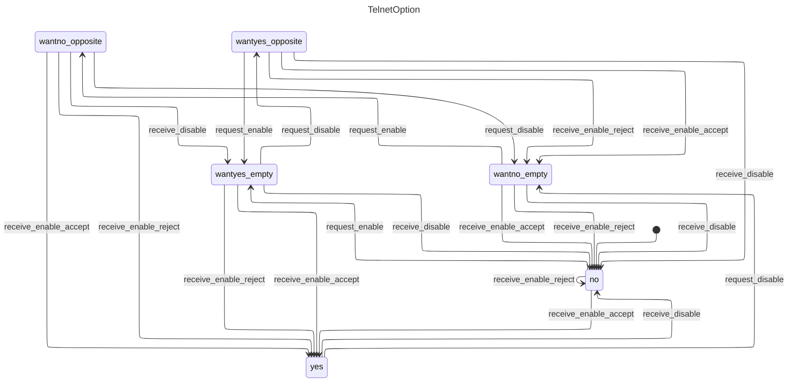

```mermaid
---
title: TelnetOption
config:
  layout: elk
  elk:
    considerModelOrder: "NONE"
---
stateDiagram-v2
[*] --> no
no --> wantyes_empty: request_enable
no --> yes: receive_enable_accept
no --> no: receive_enable_reject
yes --> wantno_empty: request_disable
yes --> no: receive_disable
wantno_empty --> wantno_opposite: request_enable
wantno_empty --> no: receive_enable_accept
wantno_empty --> no: receive_enable_reject
wantno_empty --> no: receive_disable
wantno_opposite --> wantno_empty: request_disable
wantno_opposite --> yes: receive_enable_accept
wantno_opposite --> yes: receive_enable_reject
wantno_opposite --> wantyes_empty: receive_disable
wantyes_empty --> wantyes_opposite: request_disable
wantyes_empty --> yes: receive_enable_accept
wantyes_empty --> yes: receive_enable_reject
wantyes_empty --> no: receive_disable
wantyes_opposite --> wantyes_empty: request_enable
wantyes_opposite --> wantno_empty: receive_enable_accept
wantyes_opposite --> wantno_empty: receive_enable_reject
wantyes_opposite --> no: receive_disable
```
