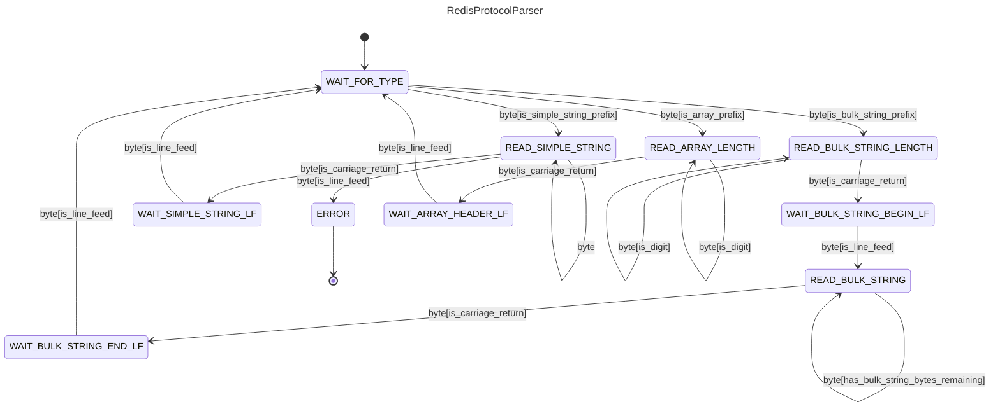

```mermaid
---
title: RedisProtocolParser
---
stateDiagram-v2
[*] --> WAIT_FOR_TYPE
WAIT_FOR_TYPE --> READ_SIMPLE_STRING: byte[is_simple_string_prefix]
WAIT_FOR_TYPE --> READ_BULK_STRING_LENGTH: byte[is_bulk_string_prefix]
WAIT_FOR_TYPE --> READ_ARRAY_LENGTH: byte[is_array_prefix]
READ_SIMPLE_STRING --> ERROR: byte[is_line_feed]
READ_SIMPLE_STRING --> WAIT_SIMPLE_STRING_LF: byte[is_carriage_return]
READ_SIMPLE_STRING --> READ_SIMPLE_STRING: byte
WAIT_SIMPLE_STRING_LF --> WAIT_FOR_TYPE: byte[is_line_feed]
READ_BULK_STRING_LENGTH --> READ_BULK_STRING_LENGTH: byte[is_digit]
READ_BULK_STRING_LENGTH --> WAIT_BULK_STRING_BEGIN_LF: byte[is_carriage_return]
WAIT_BULK_STRING_BEGIN_LF --> READ_BULK_STRING: byte[is_line_feed]
READ_BULK_STRING --> READ_BULK_STRING: byte[has_bulk_string_bytes_remaining]
READ_BULK_STRING --> WAIT_BULK_STRING_END_LF: byte[is_carriage_return]
WAIT_BULK_STRING_END_LF --> WAIT_FOR_TYPE: byte[is_line_feed]
READ_ARRAY_LENGTH --> READ_ARRAY_LENGTH: byte[is_digit]
READ_ARRAY_LENGTH --> WAIT_ARRAY_HEADER_LF: byte[is_carriage_return]
WAIT_ARRAY_HEADER_LF --> WAIT_FOR_TYPE: byte[is_line_feed]
ERROR --> [*]
```
